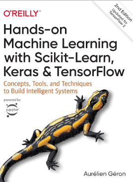
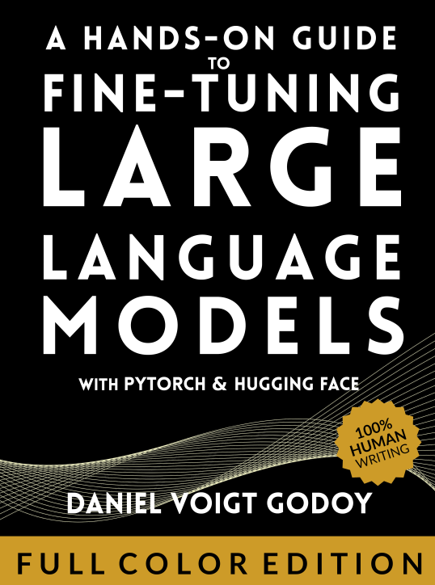
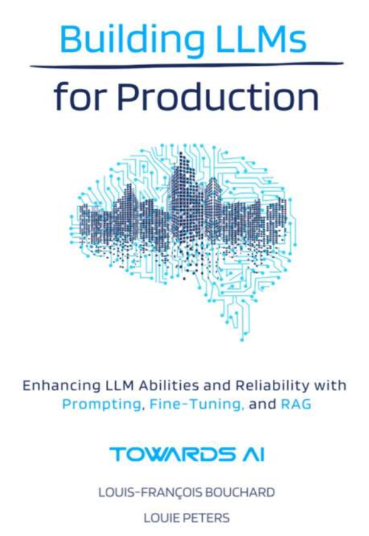
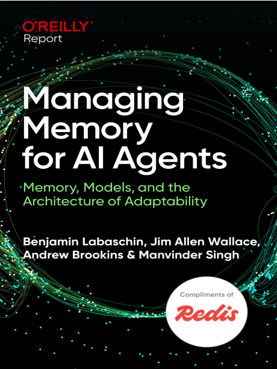
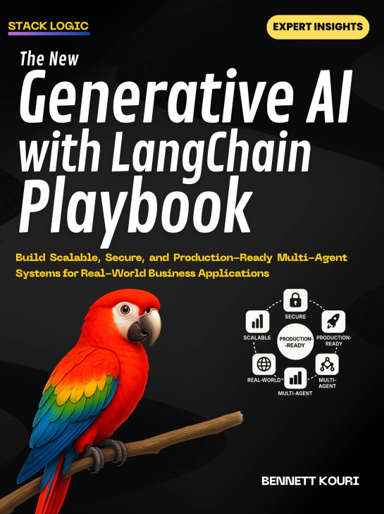
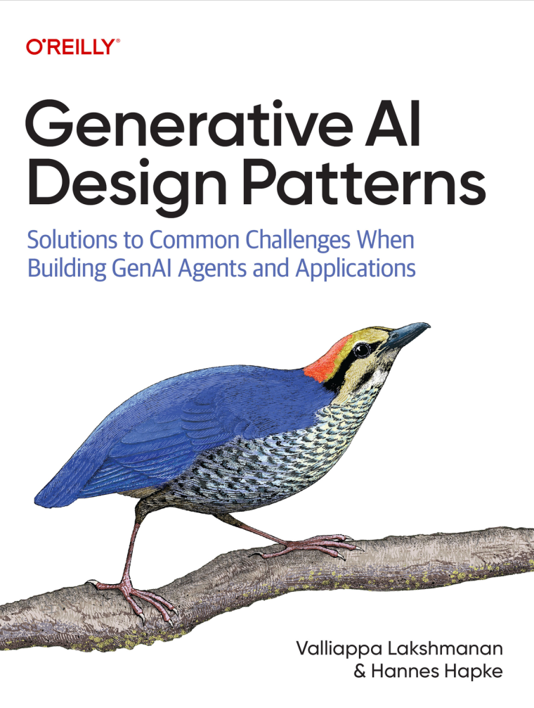
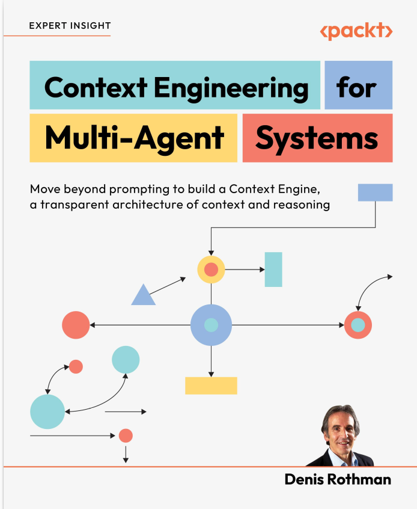
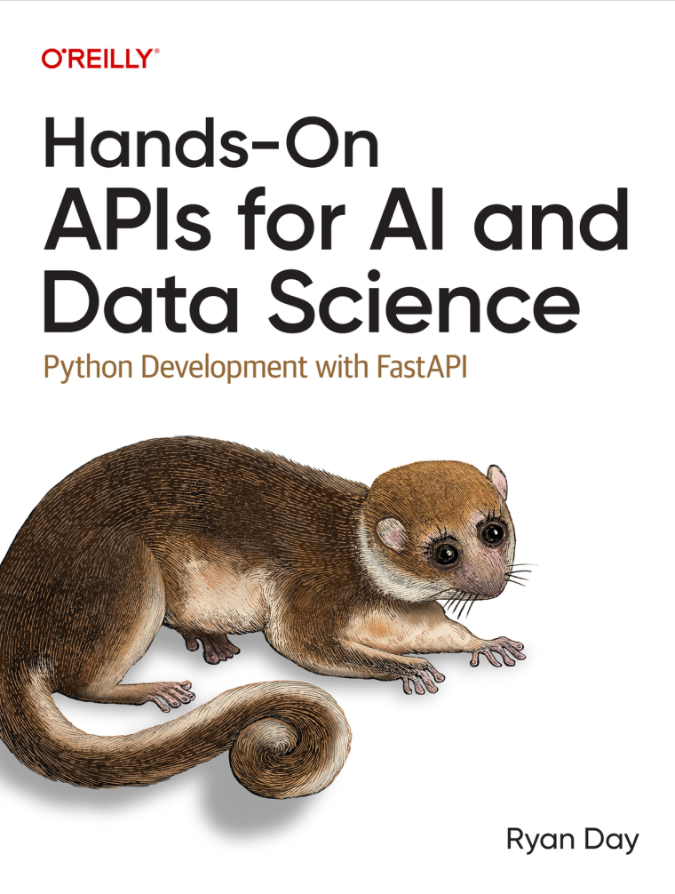
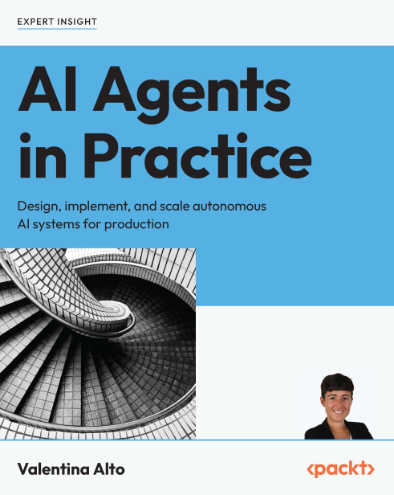
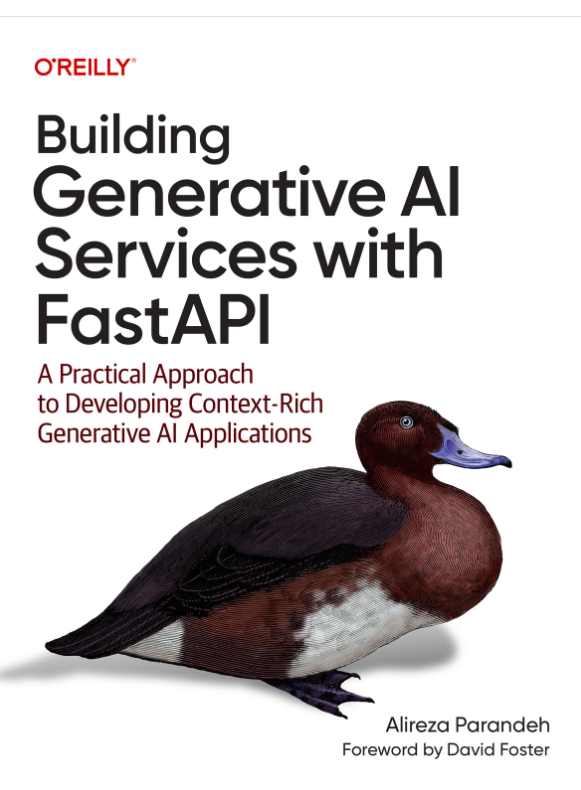

# My Reading List

Books I've read and am currently reading across AI/ML and general topics — with progress tracking and linked code repositories.

---

## AI / ML & Engineering — Books
## AI / ML & Engineering — Books

| Cover | Title | Author | Progress | Status | Repository |
|:-----:|-------|--------|:--------:|:------:|:----------:|
|  | **Hands-On Machine Learning with Scikit-Learn, Keras & TensorFlow** | Aurélien Géron | `███░░░░░░░` 30% | On Hold | — |
|  | **Deep Learning with PyTorch Step-by-Step** | Daniel Voigt Godoy | `██████░░░░` 60% | On Hold | [here](https://github.com/ujjwal-basnet/Deep-learning-by-Daniel-Voigt-Godoy-) and others in did't even push to github |
|  | **Fine-Tuning Large Language Models** | dvgodoy | `██████████` 100% | Complete | [Fine-Tuning-LLM](https://github.com/ujjwal-basnet/Fine-Tuning-LLM) |
|  | **Building LLMs for Production** | — | `██████████` 100% | Complete | [here - ](https://github.com/ujjwal-basnet/Building-LLMs-for-Production) |
|  | **Building LLM Powered Applications** | — | `████████░░` 80% | On Hold | [llm](https://github.com/ujjwal-basnet/Building-LLMs-for-Production)  and others mini projects|
|  | **Managing Memory in AI Agents** | — | `██████████` 100% | Complete | — |
|  | **Generative AI Playbook** | — | `███░░░░░░░` 30% | In Progress | [battle_tested_code](https://github.com/ujjwal-basnet/battle_tested_agent_codes) |
|  | **Generative AI Design Patterns** | — | `██░░░░░░░░` 20% | In Progress | — |
|  | **Context Engineering for Multi-Agent Systems** | — | `███████░░░` 75% | In Progress | [contex_eng](https://github.com/ujjwal-basnet/Context-Enginnering) |
|  | **Building Data & AI Platform with PostgreSQL** | — | `██████████` 100% | Complete | [learning](https://github.com/ujjwal-basnet/postgress_learning) |
|  | **Building APIs for AI and Data Science** | — | `██████░░░░` 60% | In Progress | [buildingSDK](https://github.com/ujjwal-basnet/building_sdk) · [building_api](https://github.com/ujjwal-basnet/building_api) |
|  | **AI Agents in Practice** | — | `███████░░░` 70% | In Progress | — |
|  | **Agentic Architectural Patterns** | — | `████░░░░░░` 40% | In Progress | [agentic](https://github.com/ujjwal-basnet/Agentic_Architectural_Patterns_for_Building_Multi_Agent) |
|  | **Building Generative AI Services with FastAPI** | — | `██████░░░░` 60% | In Progress | [fastapi](https://github.com/ujjwal-basnet/fastapi_for_ml_ai_enginners) , [async](https://github.com/ujjwal-basnet/asynchronous-agents-code) |

---

## AI / ML & Engineering — Reports book - O'reilly

| Cover | Title | Progress | Status | Notes |
|:-----:|-------|:--------:|:------:|-------|
|  | **Managing Memory in AI Agents** | `██████████` 100% | Complete | — |
|  | **Building Data & AI Platform with PostgreSQL** | `██████████` 100% | Complete |  |

---

## General Reading
 
| Cover | Title | Author | Progress | Status | Notes |
|:-----:|-------|--------|:--------:|:------:|-------|
| — | **Atomic Habits** | James Clear | `██████████` 100% |  no more self help boook , i dont much
| — | **Sapiens: A Brief History of Humankind** | Yuval Noah Harari | `██████████` 100% | In Progress | — |
| — | **Learning by Doing** |  | `██` 30% | not reading anymore | — |
| — | **How Sex change internet and internet change sex** |  | `██████████` 70% | not reading anymore | — | 

---

*Last updated: March 2026*